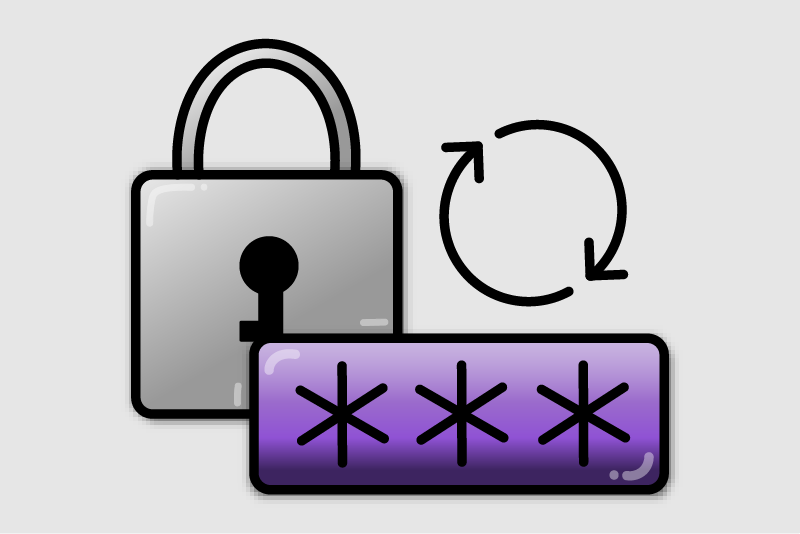

# Memorable Password Generator Chrome Extension

**Group:** Lily Spurgat, Sam Spurlock, Kate Spencer<br>
**Course:** CS 433: Computer & Network Security<br>
**Dates:** January 12 - March 15 2025<br>

## Problem Statement & Status Quo
People often use insecure passwords or reuse the same password for multiple sites, creating security problems. Everyone struggles with creating passwords that are both memorable and secure! 

There are other existing password generators, but many of them generate completely random passwords that are difficult to remember or do not allow for customization or work-banking options. Furthermore, tools that have more features are often locked behind a paywall, making them inacessible to the general public.

## What This Extension Does
#### Generate passwords
  - **Passphrase mode**: generates memorable multi-word passphrases. Has the ability to generate based off of a default English dictionary, a user-defined wordbank, or both.
  - **Random mode**: generates a secure random password.
#### Test passwords
  - Provides a strength score and reasons/suggestions explaining the result.
  - Includes a leaked password check, searching to see if the inputted password has been found publicly on the internet. 

## Password Generation Parameteres
#### Passphrase generator parameters:
- How many words (>2)
- Choose a seperator between words (i.e., -, _,  , ;)
- Capitalization (randomized)
- Digits (placed at the end)
- Symbols (placed at the end)
- Embedded Symbols (replace digits or letters with related symbols)

#### Random password generator parameters:
- How many characters
- Symbols (placed at the end)

### Default Generation Settings
The default passphrase generator settings are:
- 4 words
- `-` as a separator
- Capitalization & Digits enabled
- Symbols & Symbol embedding disabled

The default random password generator settings are:
- 18 characters
- Symbols disabled

&nbsp;
# How to run

## Development Setup (Install Locally)
1. Clone the repository: 
```bash 
git clone https://github.com/sspurlo2/password_generator.git 
```
2. Open Chrome → `chrome://extensions`
3. Enable **Developer mode**
4. Click **Load unpacked**
5. Select the `password_generator/extension/` folder

## Testing / Experiments
The `extension/tests/` directory contains scripts that generate 100 passwords/passphrases and their scores, so we can analyze mean/median strength under different settings.

```bash
npm install
node extension/tests/passphrase_generation_test.js
```
OR
```bash
npm install
node extension/tests/random_generation_test.js
```

To do a full test run, we have a shell file that will run both tests. To run this, you must be in the /password_generator folder.

```bash
/extension/tests/./run_test.sh
```

The test writes output to `extension/tests/passphrase_generation_results.json` or `extension/tests/random_generation_results.json` (both if using run_test.sh)

## Languages & Technologies
JavaScript, CSS, and HTML. Node (for /test files, not extension)<br>
API: [Have I Been Pwned](https://haveibeenpwned.com/api/v3)<br>
Buttons: [Switch by andrew-demchenk0](https://uiverse.io/andrew-demchenk0)<br>

## Repo Layout
The extension code is in `extension/` (Manifest V3).

```
extension/
├── _locales/           
│   └── en/             
│       └── messages.json
├── content_scripts/    
│   └── README.md
├── icons/              
│   └── icon_128.png    
├── options/           
│   ├── options.html
│   ├── options.css
│   └── options.js
├── popup/              
│   ├── popup.html
│   ├── popup.css
│   └── popup.js
├── src/      
│   ├── background.js   
│   ├── generator.js    
│   ├── dictionary.json 
│   ├── leakedCheck.js  
│   ├── strength.js     
│   └── uiModel.js 
├── tests/ 
│   ├── clear_script.sh
│   ├── passphrase_generation_test.js
│   ├── random_generation_test.js
│   ├── README.md
│   └── run_test.sh
├── DIRECTORY_STRUCTURE.md
└── manifest.json
```
